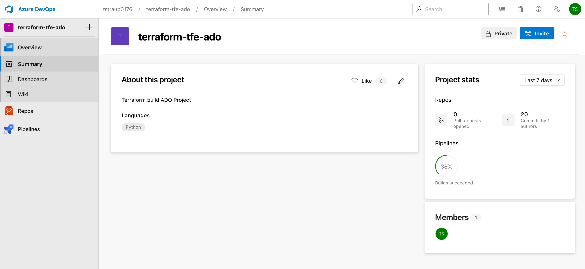
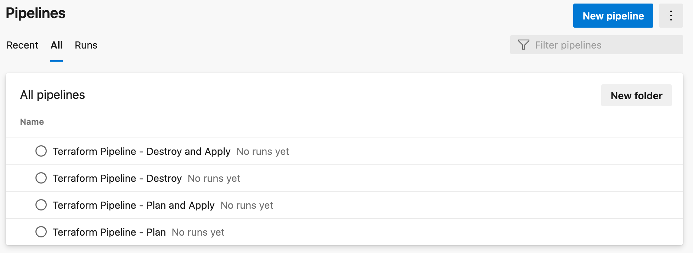
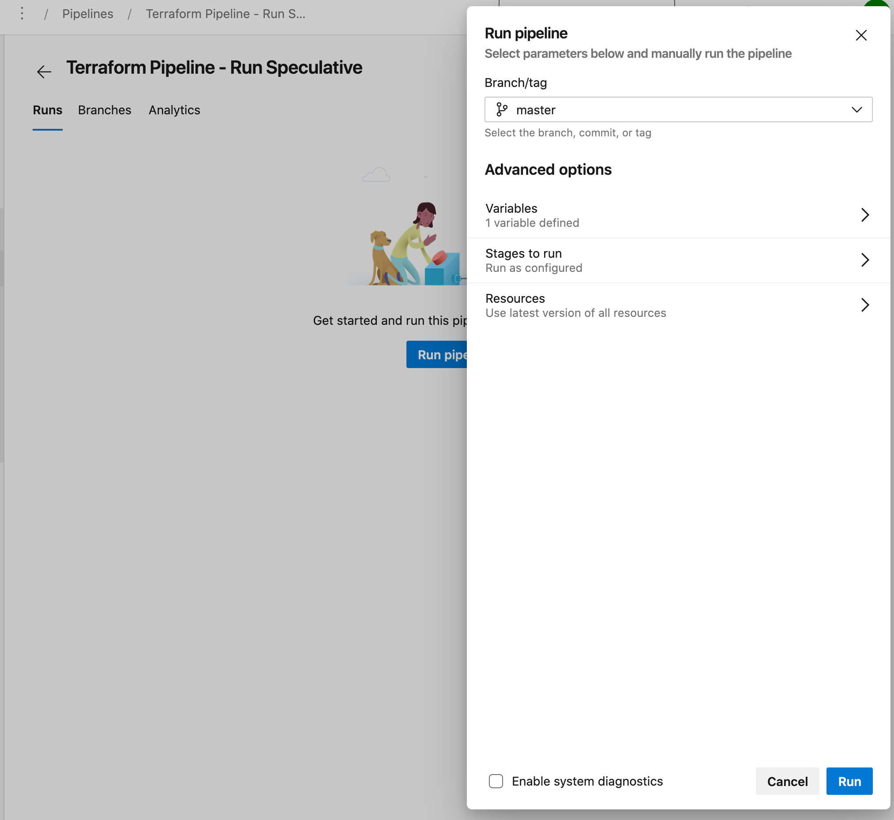
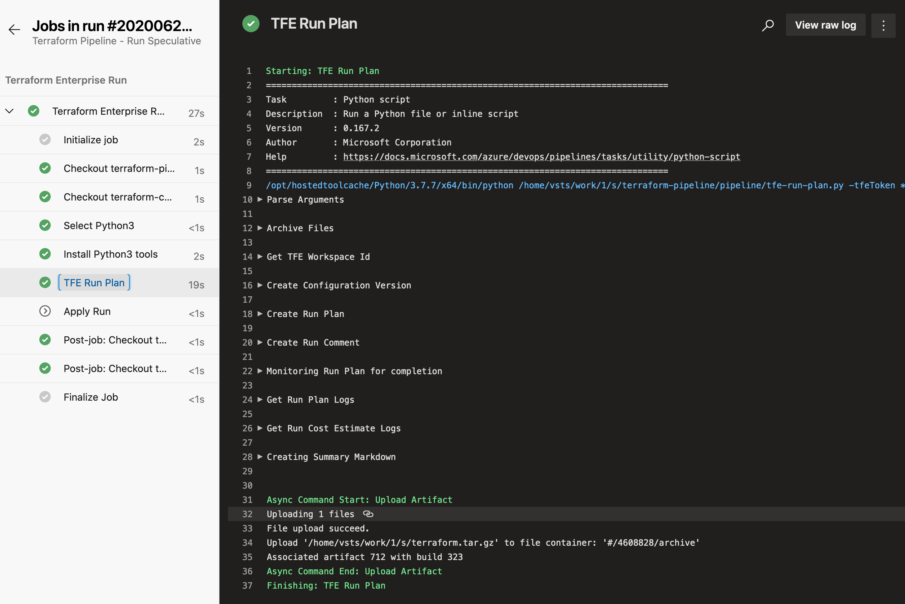

# Azure DevOps and Terraform Enterprise Integration

This repo aims to contain everything needed to demonstrate how to integration TFE to Azure DevOps.

Now that there is an official [Azure Devops Terraform Provider](https://www.terraform.io/docs/providers/azuredevops/index.html), codifying this workflow and integration becomes easier to implement in a repeatable fashion.

## Resources

The root of this repository contains Terraform to deploy the following:

- ADO Project
- ADO Git Repo `terraform-pipeline`
  - Repo is seeded from the folder `./repo-pipeline-code`
  - Contains all the pipeline templates and python scripts
- ADO Git Repo `terraform-code`
  - Repo is seeded from the folder `./repo-terraform-code`
  - Contains the terraform we wish to run through our TFE workspace.
  - Contains the pipeline .yml that references the templates in the other repo
- TFE Workspace `ado-terraform-dev`
  - Will be the workspace the Build Pipelines integrate with
- ADO Build Pipeline `Terraform Pipeline - Run Speculative`
  - Integrates to the TFE Workspace
  - Performs a Speculative Plan
- ADO Build Pipeline `Terraform Pipeline - Run Apply`
  - Integrates to the TFE Workspace
  - Performs a Plan and Auto Apply
- ADO Build Pipeline `Terraform Pipeline - Destroy`
  - Integrates to the TFE Workspace
  - Performs a Destroy and Auto Apply

### Getting Started

Be sure the have credentials available for both the ADO and TFE providers.

ADO Provider:

```
export AZDO_PERSONAL_ACCESS_TOKEN=<Your Personal Access Token>
export AZDO_ORG_SERVICE_URL=https://dev.azure.com/<Your Org Name>
```

TFE Provider:

```
export TFE_HOSTNAME=<Your Hostname of TFE, or app.terraform.io if TFC>
export TFE_TOKEN=<Your TFE API Token>
```

> NOTE: Update the `./repo-terraform-code/ci/tfe-*.yml` files to include the the right ADO Project name.

### Terraform

After successfully running the Terraform you should be able to navigate to ADO and TFE to begin running workflows.

Azure DevOps New project, note the dynamic pet name:



View the Repositories that were created, note the default creation of a repo with the same name as the project (please ignore/delete this repo):


View the Build Pipelines that were created:



Trigger the Build Pipeline "Terraform Pipeline - Run Speculative":



**Manual Step**

On the first trigger of the Build Pipeline you will have to "Permit" the pipeline to communicate with the `terraform-pipeline` repo:


View the Pipeline execution and wait for it to complete:



Back in the Build page, click the "Extensions" tab to see a Summary:


Click the link to be taken to your TFE Workspace:


### Next Steps

Try the `Terraform Pipeline - Run Apply` and `Terraform Pipeline - Destroy` Build Pipelines as well.

## Design Choices

This repository leverages python as the underlying scripting language, in the hopes to add additional testing and readability.

## Resources

- [ADO Logging](https://docs.microsoft.com/en-us/azure/devops/pipelines/scripts/logging-commands?view=azure-devops&tabs=bash)
- [Python Task](https://docs.microsoft.com/en-us/azure/devops/pipelines/tasks/utility/python-script?view=azure-devops)
- [Run States](https://www.terraform.io/docs/cloud/api/run.html#run-states)
- [ADO yaml task](https://docs.microsoft.com/en-us/azure/devops/pipelines/artifacts/pipeline-artifacts?view=azure-devops&tabs=yaml-task)
- [ADO yml](https://aka.ms/yaml)
- [ADO yml templates](https://docs.microsoft.com/en-us/azure/devops/pipelines/process/templates?view=azure-devops)
- [ADO multiple repo checkout](https://docs.microsoft.com/en-us/azure/devops/pipelines/repos/multi-repo-checkout?view=azure-devops)
